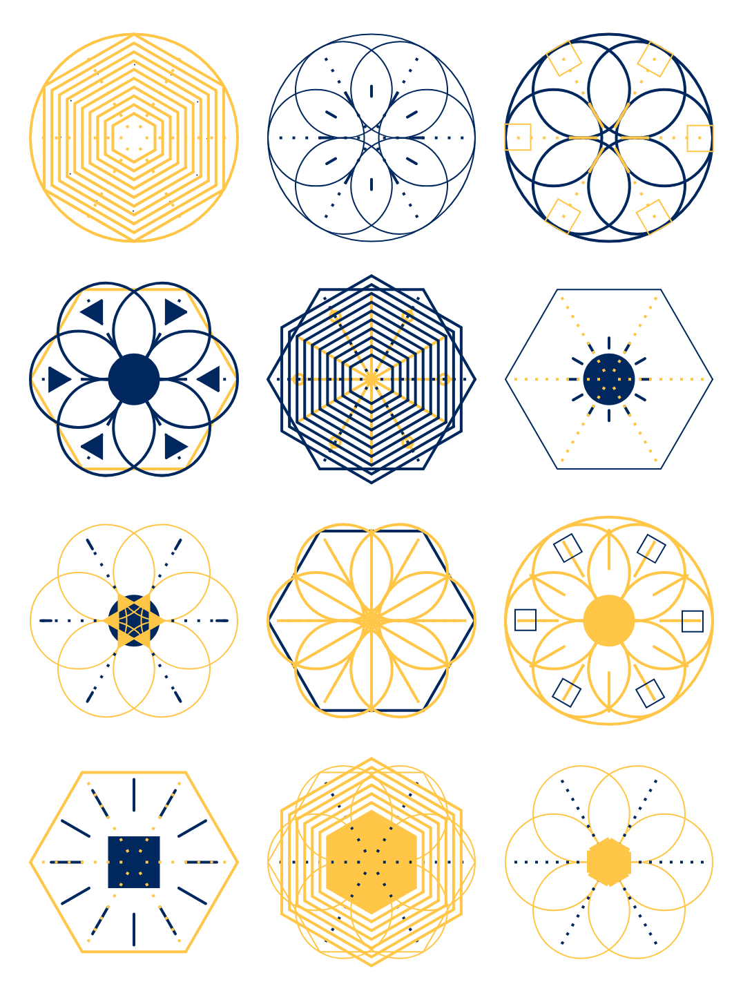
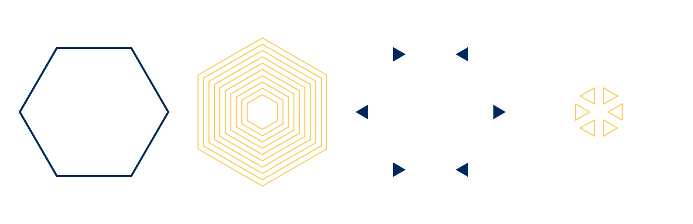

The other day I finally watched Matthew Epler’s fantastic Youtube series [Designing Generative Systems with p5.js](https://www.youtube.com/playlist?list=PLyRZnpOSgMj3K8AV2I6UldnvTj6d_Zrf0). He takes you from setting up your [p5](https://p5js.org/) sketch to a full-fledged generative design system that creates crystals like these:



Here I want to go into a bit of detail on what I learned and changed in the course of implementing this crystal generator. Most notably: While Matthew is using the [p5.js-svg library](https://github.com/zenozeng/p5.js-svg) with p5 0.4.13, I decided to go for the latest p5 version (0.6.1 at the time of writing) and ditch the SVG support instead.

Check out the accompanying [app on Glitch](https://generative-crystals.glitch.me/) or the [source code on Github](https://github.com/stephanmax/generative-crystals).

## The New `random` Function

The whole generative system is based on using p5’s `random` function—a lot! We randomly choose color, shape, arity, stroke weight… you get the picture. Matthew had to implement this notion of choice from nothing but random float numbers which lead to helper functions like these:

```javascript
const PALETTE = [
  color(255, 52, 154),
  color(4, 0, 152)
]

function randomSelectTwo () {
  const rando = random(1)
  if (rando > 0.5) {
    return true
  } else {
    return false
  }
}

function getRandomFromPalette () {
  const rando2 = floor(random(0, PALETTE.length))
  return PALETTE[rando2]
}
```

Today we can call `random` with an array and get a random element back. No more helper functions needed:

```javascript
const color = random([
  color(255, 52, 154),
  color(4, 0, 152)
])
```

### No Global Scope Pollution

I appreciate that Matthew takes his time to shed some light on code organization, refactoring, and implementation best practices. Still, he heavily relies on global variables that he reuses in all his files and classes. I wanted to take things a bit further and settled with an implementation where

* every design element resides in its own file with a class that extends a generic `Layer` class
* there are no global variables except p5’s `setup`, `draw`, and `windowResized` functions, everything else is passed down to the instantiated objects as parameters of the constructor call
* classes and helper functions are exported/imported as ES6 modules
* everything is transpiled and bundled up nicely with [rollup.js](https://rollupjs.org/guide/en)

See my `Circles` class, for example:

```javascript
import Layer from './Layer.js'

export default class Circles extends Layer {

  constructor() {
    super(...arguments)

    this.shapeSize = this.radius * .93
    this.posX = this.radius - (this.shapeSize / 2)
  }

  render() {
    noFill()
    stroke(this.color)

    push()

    for (let i = 0; i < this.numShapes; i++) {
      ellipse(this.posX, 0, this.shapeSize, this.shapeSize)
      rotate(this.angle)
    }

    pop()
  }

}
```

## Powerful Helpers Before One-Off Implementations

A lot of the perceived variety in the crystals above stems from using hexagons and triangles of different size and direction. Instead of writing two helper functions `hexagon` and `triangle` and implementing one-off `if` guards to decide which direction they should have, I decided to go for one helper function `polygon` with an optional angle offset (where `n` is the number of sides, `x` and `y` are the position, and `r` is the radius):

```javascript
export function polygon(n, x, y, r, angleOffset = 0) {
  const angle = 360 / n
  beginShape()
  for (let i = 0; i < n; i++) {
    var nextX = x + cos(i * angle + angleOffset) * r
    var nextY = y + sin(i * angle + angleOffset) * r
    vertex(nextX, nextY)
  }
  endShape(CLOSE)
}
```

That way I was able to generate all needed shapes with just one function, passing in `angleOffset` if I needed to:



Better yet, this solution scales in case I decide to include pentagons or triangles with all sorts of directions in the future.

## Dynamic Grid Placement

Instead of going for a fixed 3 &times; 4 grid of crystals I wanted to come up with a simple grid placement algorithm that uses the full viewport available. It works like this:

```javascript
const CRYSTAL_SIZE_MAX = 150 // 1.
const GAP_MIN = 10 // 1.

const crystalSize = min(CRYSTAL_SIZE_MAX, min(windowWidth, windowHeight) - 2 * GAP_MIN) // 2.

const cols = int((windowWidth - GAP_MIN) / (crystalSize + GAP_MIN)) // 3.
const rows = int((windowHeight - GAP_MIN) / (crystalSize + GAP_MIN)) // 3.

const gapHor = (windowWidth - cols * crystalSize) / (cols + 1) // 3.
const gapVer = (windowHeight - rows * crystalSize) / (rows + 1) // 3.

for (let i = 0; i < cols * rows; i++) { // 4.
  const x = gapHor + crystalSize / 2 + (i % cols) * (crystalSize + gapHor)
  const y = gapVer + crystalSize / 2 + int(i / cols) * (crystalSize + gapVer)

  new Crystal(x, y, crystalSize).render()
}
```

1. The constants `CRYSTAL_SIZE_MAX` and `GAP_MIN` are the crystal’s maximum size and the minimum gap (serves both as margin between crystals and padding of the canvas) in pixels
2. We calculate the actual crystal size. It is either the maximum size or whatever size is available  (horizontally *or* vertically) after subtracting the minimum gap twice for the padding
3. Next we calculate the number of columns and rows and the actual gap we will use
4. In the last step we loop over the number of crystals and calculate the x and y position for each one (with a little help of the modulo operator `%`, so we can do it in one `for` loop instead two nested loops for columns and rows)

Fortunately, p5 already ships with a handler that automatically calls the `draw` function if the window is resized. All we need to do is resize the canvas and we got a fully responsive crystal grid:

```javascript
window.windowResized = () => {
	resizeCanvas(windowWidth, windowHeight)
}
```
