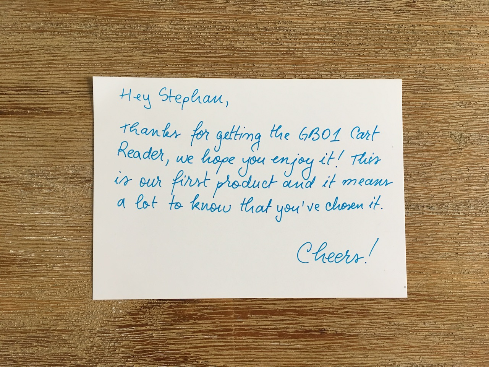
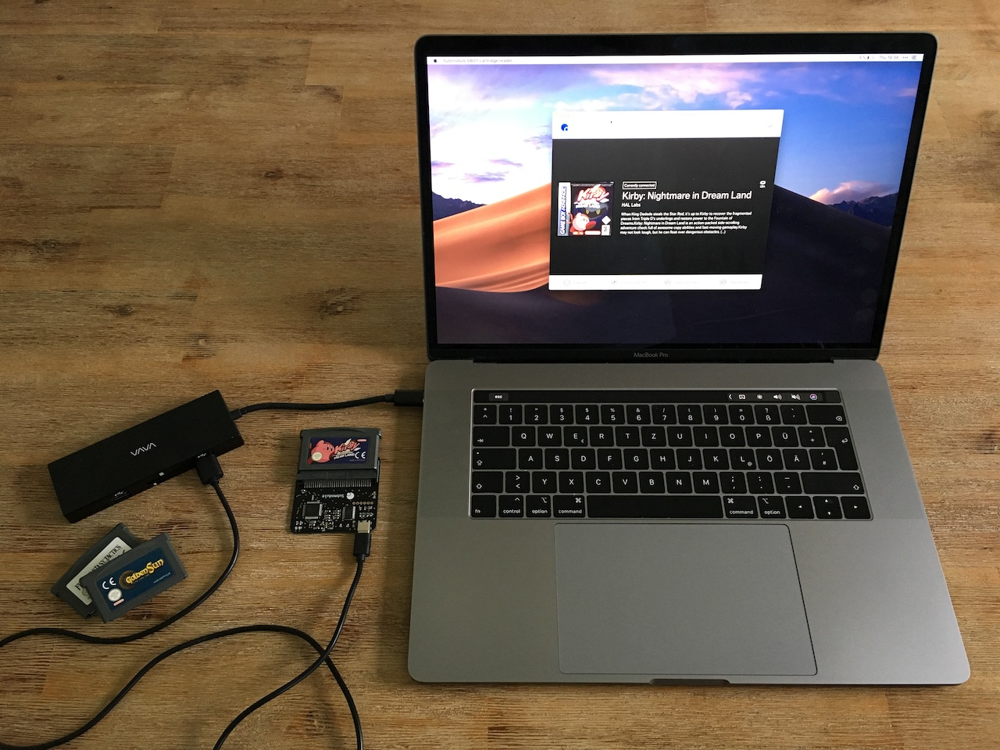
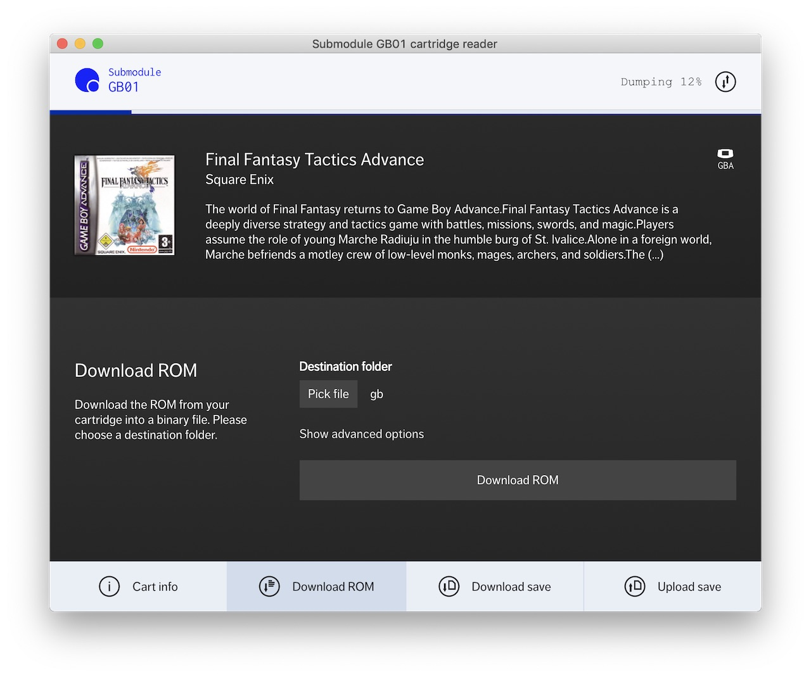
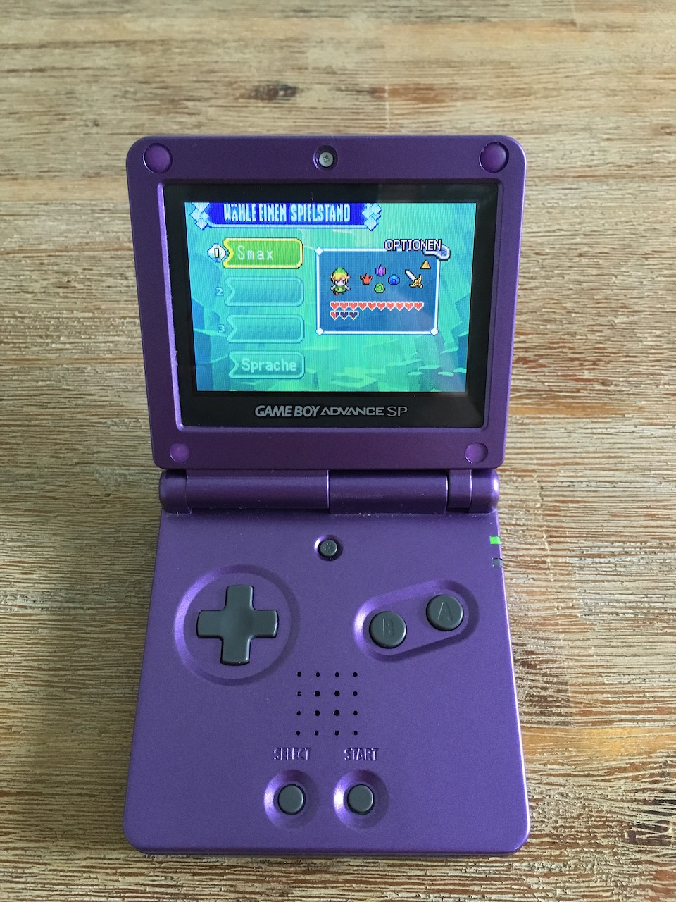

The <i>GB01 Cart Reader</i> by <i>Submodule</i> reads all your Game Boy/Game Boy Color/Game Boy Advance cartridges and dumps them as roms onto your computer. After seeing it being covered by [Retro Game Couch](https://www.youtube.com/watch?v=dsrlM1nDnyE) and [The Retro Future](https://www.youtube.com/watch?v=XhAYsF4g3zY) I finally bought one last week. Here I document my first steps with this nifty device.

The GB01 comes in a nice and sturdy box with a lovely attention to detail. Let’s have a look.

, a little stick pin, the actual cart reader, and a USB-C cable.")

Submodule also added a hand-written thank you note for buying the GB01 which I think is a great way of appreciating your (early) customers. Well done!

## Dumping Roms

First I tried to dump all my Game Boy games onto my computer. Although I always have used roms and emulators, I find it oddly calming to know that everything that runs in my emulator now are direct rom dumps from my actual physical copies.

The process is extremely easy: Just plug the cart reader into your laptop, [download the software](https://submodule.co/gb01/manual) (Windows/Mac/Linux), pop your game into the reader, wait a couple of seconds (which Submodule uses to go to there own database to download name, description, and cover art of the game), and hit <i>Download Rom</i>. It takes from a couple of seconds (for gb/gbc files) to a few minutes (for gba files) to download the rom.

Submodule is constantly updating both the software and the cart reader’s firmware. (I already got numerous updates since I bought it.) Also, they offer to [contact their support](mailto:support@submodule.co) in case the software doesn’t recognize one of your games.

## Downloading and Uploading Saves

Even better than dumping roms is the possibility to download and upload saves. Why, you ask? Well, I think Submodule says it best on their homepage:

> If you use save editors, the GB01 allows you to edit your saves, uploading the customised saves to the cartridge itself. You can finally give yourself 10 Mews in Pokémon Gold, on the actual cartridge.

Seriously, being able to download all your game saves to your computer, to archive them, to load them into an emulator on different devices, and to never be afraid of data loss due to drained cartridge batteries is a real game changer.

I am amazed by this little device. It feels great to dump all my games to my computer and to know that my saves are… uhm, safe. The team over at Submodule put a lot of thought and love into this product.

Of course we have to talk about the price. When I ordered mine two weeks ago, I paid 52.15 € in total (35 cart reader + 9.80 shipping + 7.35 VAT). Today the cart reader costs 45 € plus 9 € for express worldwide shipping. I still think this is a great price for an amazing device—especially after I read that Submodule is planning to support writing to Game Boy cartridges.

If you are into Game Boy games, want to play your original games on emulators, or are interested in homebrew flash writing, then this is a no-brainer.
