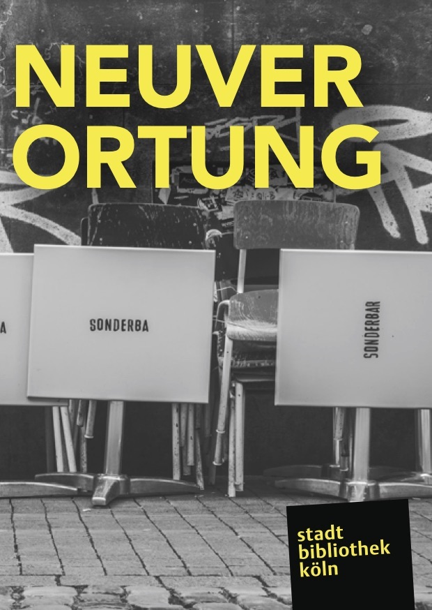
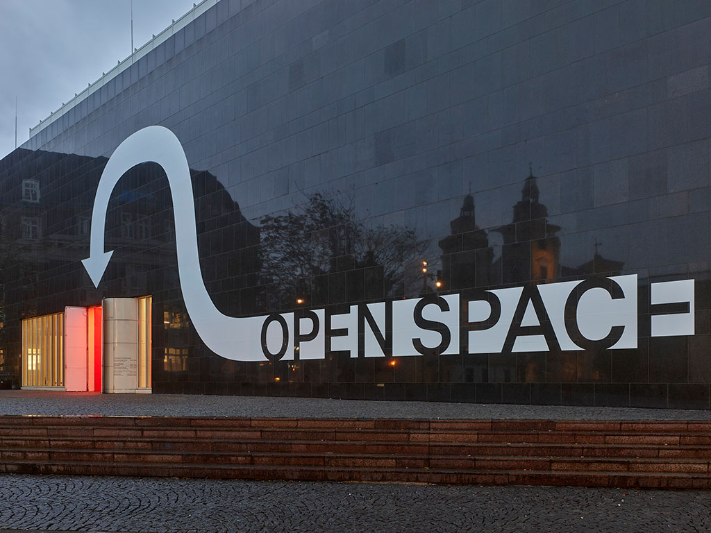
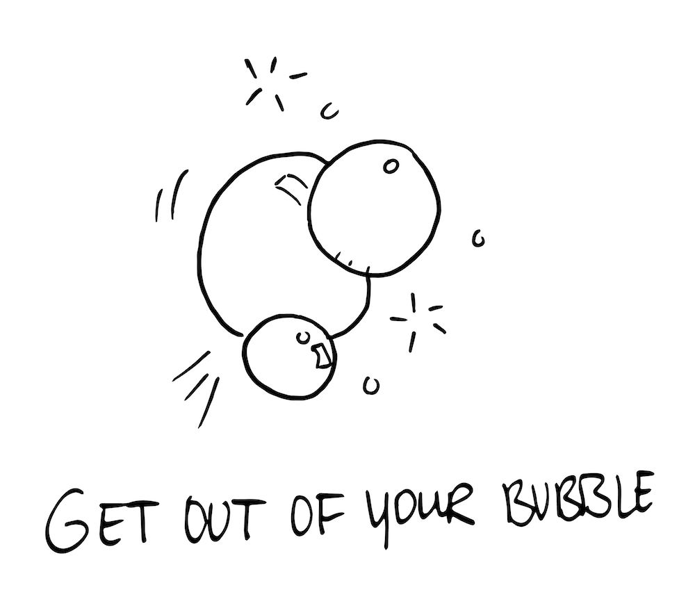

On Wednesday I attended a panel discussion titled <i lang="de">Ein warmes Pl&auml;tzchen f&uuml;r nomadische Wissensarbeiter</i> which loosely translates as <i>A cosy place for nomadic knowledge workers</i>. It was the first session of three-part program <i lang="de">Neuverortung</i> (Repositioning) that explores the need for more open, social, and public spaces in the course of the renovation of Cologne’s central library. I joined with nothing but curiosity for the topic, but left full of inspiration and thirst for action.

The two guests cover the topic from two very different angles: <i>Julia Hagenberg</i>, head of the educational section at [Kunstsammlung Nordrhein-Westfalen](https://www.kunstsammlung.de/en) (the art museum in D&uuml;sseldorf), established the [Open Space](www.kunstsammlung.de/en/education/open-space) in the museum and thus opened up a place not uncommonly associated with elitism to each and everyone. On the other side sits <i>Ronald van den Hoff</i>, president and co-founder of [Seats2Meet](https://www.seats2meet.com/), a company that turns the abundance of unused public places—think theaters during the day or schools on weekends—into coworking areas. The beauty of this concept is that knowledge workers can use those facilities without charge given they are willing to share their knowledge with others.

Although both speakers come from very different worlds—fine arts and entrepreneurship, publicly-funded and heavily subsidized institution and a company that needs to make money—they made very similar observations.

## Serendipitous Encounters

Both Julia and Ronald agree that you can witness unexpected and amazing effects once you open up a place. People who would have never met each other start to talk and self-organize and meet again. Ronald and Seats2Meet even made those <i>serendipities</i> part of the company’s DNA. The initial ideas of more than 150 books and even startups have emerged inside the Seats2Meet network. In D&uuml;sseldorf initiatives like [Pro Fahrrad](https://www.pro-fahrrad.de/) (Pro Bicycle) use the Open Space as their meeting hub and regular visitors have started a philosophy club.

However, the most heart-warming story is brought to us by Julia Hagenberg. You could tell that she is a firm believer in the concept of the Open Space and that confidence and excitement is contagious. But when she tells us that a long-time homeless person uses the open museum area to read the newspaper in the morning, she is not reporting as a museum pedagog but as a human being that is truly happy to have co-created such a safe haven for really everyone. School children come there to do their homework and some regulars feel so comfortable they drop in for a little nap. When asked for feedback, one person called the Open Space <q>the first non-snobby place in D&uuml;sseldorf.</q>

## Opening up Is Not for Everyone

After sharing all the success stories and magic moments, Julia and Ronald also cover the downsides of opening up. Although not being a problem per se, Ronald and Seats2Meet saw that sharing knowledge and dedicating time to others is not for everyone. Especially in the software development scene it is still common to have a silo mentality and only work cooperatively when you are blocked or done with the task at hand. Seats2Meet does not force such people to change, though. They are always free to leave and use other, more conventional co-working offerings. <q>But then you cannot grow,</q> says Ronald and explains that knowledge sharing and social exchange will only become more important in the future.

He concludes with a funny anecdote about a [Seats2Meet location in Tokyo, Japan](https://www.seats2meet.com/en/locations/675/GINZA-Farmers-LaBo), where collaborating without being introduced to each other first is just not culturally accepted. How do you adapt to this with a concept that deems social interaction the key value? The solution was an official mediator that took care of said introductions and the Japanese visitors accepted this workaround. I guess the moral of those two stories is that you cannot cater to all kinds of people but that you must try everything you can think of to enable them.

Julia tells a different story that made me particularly angry. When an eigth grade of a special-needs school visited the Open Space to do school work, a man close by was apparently bothered by them and rudely expressed his doubts whether these school kids even belonged there. <small>(Author’s note: Asshole!)</small> After the school kids reacted vividly by making noises as if they were mentally challenged to caricature that they are maybe not the expected frequent museum visitors, Julia Hagenberg realized two things: First, eighth-graders of special schools are well aware that they are perceived as underprivileged. And second, a place like a museum exposes them much more to discrimination than, say, a tram. She remedied that situation by providing the kids curtains so that they can have privacy whenever they feel like it. <q>Visitors must get the chance to change an open space and make it their own, </q> Julia summarizes.

## Third Place vs. Third Space

The panel discussion closes with thoughts (and clarification of some vocabulary) around <i>Society 3.0</i>, <i>Smart City</i> vs. <i>Creative City</i>, and <i>Third Place</i> vs. <i>Third Space</i>. Especially the latter struck a chord with me: I think it is important to create more open and social Third Places but we shouldn’t forget that we have the possibilities and technology to turn them into Third Spaces. Ronald van den Hof explains that a Third Space is basically a virtual layer on top of a (physical) Third Place that allows people to connect (by means of online communities, chat tools, e-learning platforms, you name it) even if Third Places become inaccessible—a topic that became only more important in the wake of the COVID-19 crisis.

This is extremely important to me as a software engineer. I don’t know how many physical places I can establish. Probably none since I don’t know shit about any of the intricacies of such an endeavour (although I would like to). But I damn sure should be on top of the technological possibilities around open cyberspaces.

## Ripple Effect?

The Open Space in D&uuml;sseldorf’s art museum and Seats2Meet’s numerous locations are not the only public areas that have opened up and Julia Hagenberg sees a little ripple effect in the Rhein-Ruhr area. She mentions

* [Embracing Realities — Safe Open Fun Space](https://www.dhaus.de/programm/a-z/embracing-realities/) at the Schauspielhaus D&uuml;sseldorf ([English program](https://www.dhaus.de/download/7112/190710_embracing_realities_01_en.pdf))
* [Die Baustelle](https://www.museenkoeln.de/rautenstrauch-joest-museum/Visitors), the open space of Cologne’s Rautenstrauch Joest museum

as shining examples. Everybody at the panel discussion agrees that the society cannot stop there. We undeniably live in a sharing economy and that sharing should not stop at knowledge or experience. Let’s keep on opening up!
